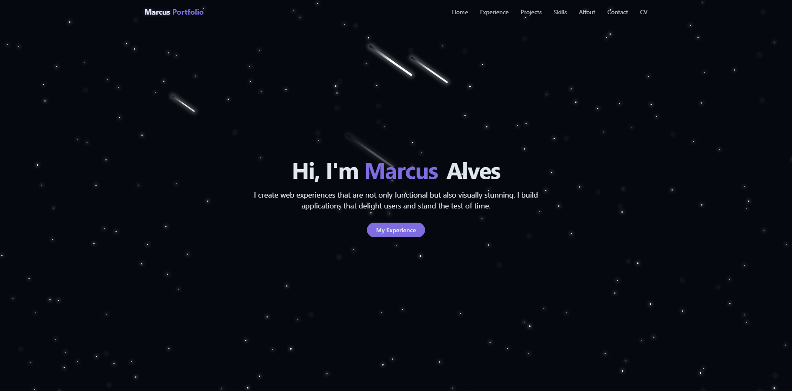

# Portfolio



The website: https://marcusalvesdev.vercel.app/

Welcome to the source code of my personal website! 👋

The site is organized into the following sections:

- **Home**
- **Experience** – An overview of my  journey in Software Engineering.
- **Projects** – An overview of my  projects in Software Engineering
- **Skills** – All my hard skills
- **About** - A paga to talk more about me
- **Contact** – My contact and an email forms
- **CV** – My resume with my experiences and informations.

---

## Technologies

This project is built using the following technologies:

- **Next.js** – A React framework for building server-rendered applications.
- **TypeScript** – A superset of JavaScript that adds static types.
- **Vite** – A fast modern frontend build tool that provides instant server start.
- **Tailwind CSS v4** – A utility-first CSS framework for rapid UI development.
- **Shadcn/ui** – A component library for building beautiful UIs with Tailwind CSS.

---

## Directory Structure

The project is organized into the following directories:

```text
src
└── components
    └── ui
    hooks
    lib
    pages
public
└── pdf
    images
    └── experience
        me
        plugin-accessibility
        projects
```

| Directory                                 | Description                                             |
| ------------------------------------------| ------------------------------------------------------- |
| `src`                                     | Root directory for Next.js application with app router. |
| `public`                                  | Public static assets like images.                       |
| `public/images  `                         | All images.                                             |
| `public/images/experience  `              | All images used on experience page.                     |
| `public/images/me  `                      | All images used on about me page.                       |
| `public/images/plugin-accessibility  `    | Brazil and USA flags.                                   |
| `public/images/projects  `                | All images used on projects page.                       |
| `src/components`                          | Projects page components and layout.                    |
| `src/hooks`                               | Endpoint for fetching movies data.                      |
| `src/lib`                                 | Library used.                                           |
| `src/pages`                               | Project pages.                                          |

## Running Locally

Clone the project

```bash
git clone https://github.com/marcusvv12/Portfolio.git
```

Go to the project directory

```bash
cd portfolio
```

Install dependencies

```bash
npm install
```

Start the server

```bash
npm run dev
```

## Figma 

[Link](https://www.figma.com/design/hxdLXylaiFGKaBiwyy54g8/Porfolio?node-id=0-1&t=Wvsfhmm3QbLnjsnK-1)
